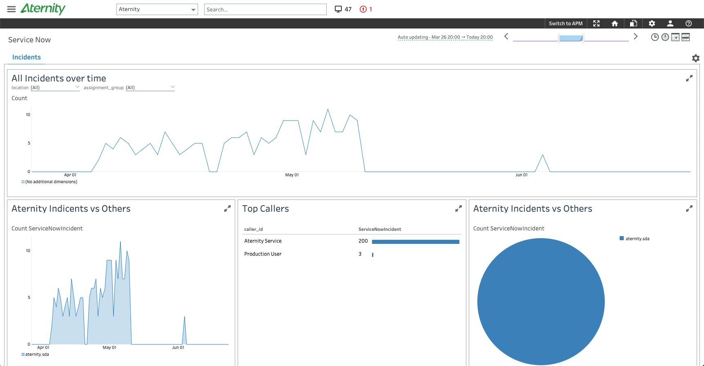

# Aternity Custom Metrics SNOW Plugin
Custom Metrics Plugin for extracting ServiceNow (SNOW) metrics.

* Incidents
    * Sample Time = 'opened_at' timestamp
    * Metric = count of 1, to represent the incident
    * Dimensions:
        * Severity
        * Location
        * Caller ID
        * Correlation Display (for Aternity generated incidents)
        * Assignment Group

# Documentation
This plugin will call the ServiceNow API for data at a regular internal (see TIME_TO_SLEEP below). At each interval, the plugin
will get all the records that are new since the last interval.

The first time the plugin runs, it will get all the records available up until that point in time.

Installation summary: to install this plugin, you will need to download the plugin files from a github repo. An agent will need to be installed and
pointed to an analysis server. The plugin files will be placed on the machine running the agent.

## Aternity APM Agent Version
11.4.0.533 and 11.4.4.502 have been tested with this plugin

Go to the support site to download and install (instructions provided on the support site):

<https://aternity.force.com/customersuccess/login>

## How to get the plugin
Download the files from the following GitHub repository:

<https://github.com/Aternity/custom-metrics-snow-plugin>

## Setup Steps
The plugin should be deployed on one agent only, otherwise the custom metrics server will receive duplicate metrics. For internal testing,
"sudo su root" was run before these setup steps were done.

All setup steps will be in the context of the agent's bin directory which is:

Linux: `/opt/Panorama/hedzup/mn/bin`   
Windows: `c:\Panorama\hedzup\mn\bin` (may be installed on any drive, potentially)   

1) Stop the Aternity APM agent. (`sudo ./dsactl stop`)

2) Put all the files that were downloaded from GitHub in the bin directory, and do the following:
 
3) Move `process.snowplugin.json` to `../metadata`   

4) Do any plugin configuration that's needed (see below).

5) Start the Aternity APM agent. (`sudo ./dsactl start`)

## Plugin Configuration
There are two properties files that should be reviewed (and modified) to configure the plugin. snow-config.properties can usually be left as-is.
snow-instance.properties must be edited to contain the specific instance and credentials that will be used when calling the API.

### snow-config.properties file
* TIME_TO_SLEEP - number of seconds to wait between API data fetches
    * default = 300 seconds (five minutes)
	  
* EARLIEST_FETCH_DATE - when the plugin first runs, this date represents the earliest records that will be pulled from the API (any records
  that have a timestamp before this date will not be published as metrics)
    * default = 2020-01-01 00:00:00
     
* NUM_ROWS_TO_FETCH - number of rows (records) to pull from the API at a time
    * default = 100 rows (this may cause multiple API calls during a particular interval, if the number of rows to fetch (since last time) 
    exceeds this number. This is expected.) 

### snow-instance.properties file
* SNOW_INSTANCE - the unique identifier for a particular ServiceNow instance (if https://ven12345.service-now.com, then this value should be set to ven12345)
* USERNAME - username for API access 
* PASSWORD - password for API access

### snow-tracking.properties file
This file is used internally by the plugin to track what records in the API have already been retrieved. Do not edit this file.

## Miscellaneous
The snow-error.log and snow-message.log files in the bin directory are the log files for the plugin.

The snow-tracking.properties file keeps track of what record is the next to get, the next time the API is called. If, for some reason, the
plugin fails to work, it may be possible to modify this file to retrieve records that were missed. Generally, the file shouldn't need to 
be edited. If it does need to be edited, care should be taken, though, since getting the same record twice, by accident, will result in 
duplicate metrics appearing in Custom Metrics. This file is updated every time an interval/fetch happens.

EARLIEST_FETCH_DATE, if modified, should be modified before the plugin first runs. After that, EARLIEST_FETCH_DATE should not be modified.
